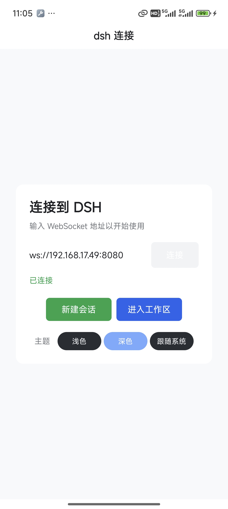
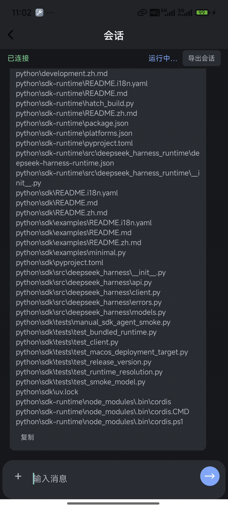
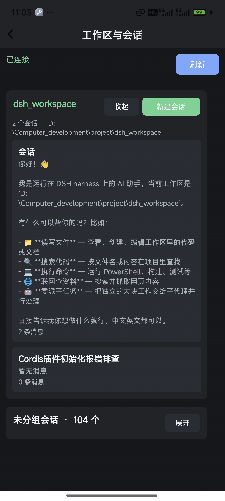
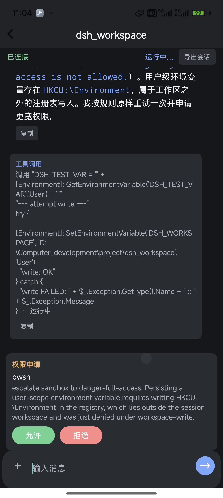
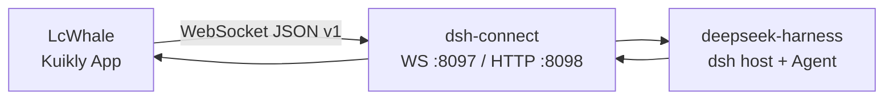

# LcWhale

> 基于 Kuikly + Kotlin Multiplatform 的跨端 DSH 客户端。
> 通过 WebSocket 连接 [dsh-connect](https://github.com/woshilaixuex/dsh_connect)，在 Android、iOS 和 OpenHarmony 上使用 dsh 的 Agent、会话、工具调用与审批能力。

相关项目：

- App：<https://github.com/woshilaixuex/LcWhale>
- dsh-connect plugin：<https://github.com/woshilaixuex/dsh_connect>

## 界面预览

截图存放在 [`docs/image`](docs/image) 目录中。

| 首页 / 连接 | 任务执行与思考推理 | 多轮会话 | 审批 |
|:---:|:---:|:---:|:---:|
|  |  |  |  |

### 演示视频

点击封面播放完整演示：

[](https://github.com/woshilaixuex/LcWhale/releases/download/v0.1.0/demo.mp4)

## 这是什么

LcWhale 是 dsh 的移动端与跨端操作界面。它不直接运行模型，而是连接局域网中已启动的 dsh-connect plugin；plugin 再将请求交给 deepseek-harness 的 dsh Agent，并把任务事件实时回传。

- 输入 WebSocket 地址并连接 dsh，自动记住上次使用的地址。
- 一次性任务：发送 `agent.run`，实时展示思考、回复、工具调用、工具结果和最终状态。
- 多轮会话：创建、恢复、切换、发送、停止和软删除会话。
- 工作区与会话列表：读取 plugin 的实时数据。
- 审批桥接：dsh 请求权限时在客户端展示，允许或拒绝后继续任务。
- 跨端共享业务代码：主要逻辑在 `shared/src/commonMain`，平台目录只负责宿主和原生桥接。

## 架构



默认端口是 WS `8097`、HTTP `8098`。plugin 根目录 `.env` 能覆盖端口，连接页应以 plugin 日志中的实际监听端口为准。

## 快速开始

### 环境要求

| 工具 | 要求 |
|---|---|
| JDK | 17（推荐 Temurin 17） |
| Android Studio | Android SDK 34，设备或模拟器 API 23+ |
| Gradle | 使用仓库自带 `gradlew`，无需单独安装 |
| Node.js / pnpm | 启动 dsh-connect 与 deepseek-harness；Node 22+、pnpm |
| iOS | macOS、Xcode、CocoaPods，iOS 14.1+ |
| OpenHarmony | DevEco Studio、SDK 与签名配置 |

### 1. 从 GitHub 安装并注册 dsh-connect plugin（必需）

先准备 dsh 宿主。以下命令不依赖本机固定路径：

```powershell
git clone https://github.com/woshilaixuex/dsh_connect.git
git clone https://github.com/deepseek-ai/deepseek-harness.git
cd deepseek-harness
pnpm install
```

先构建 plugin，再用 dsh 的 profile 管理命令注册本地目录：

```powershell
cd ..\dsh_connect
pnpm install
pnpm build
cd ..\deepseek-harness
pnpm dsh plugin --profile lcwhale add ..\dsh_connect
```

`dsh-connect` 的 `package.json` 声明了 `dsh.bundle.patch`。因此 `add` 会自动把它注册到 `lcwhale` profile 的 bundle 列表，不需要手动编辑 `cordis.patch.yml`。仓库的 `lib/` 是编译产物且不提交，不能跳过 `pnpm build`。随后启动宿主：

```powershell
pnpm dsh --profile lcwhale
```

看到类似 `ws server listening on 0.0.0.0:8097`（或环境变量覆盖后的端口）即可继续。可用 HTTP 健康检查确认：

```powershell
curl http://127.0.0.1:8098/health
```

### 2. 启动 Android App

```powershell
git clone https://github.com/woshilaixuex/LcWhale.git
cd LcWhale
.\gradlew.bat :androidApp:installDebug
```

也可以只构建 APK：

```powershell
.\gradlew.bat :androidApp:assembleDebug
adb install -r -t androidApp\build\outputs\apk\debug\androidApp-debug.apk
```

USB 调试时将电脑端口映射到设备：

```powershell
adb reverse tcp:8097 tcp:8097
```

打开 App 后填写 `ws://127.0.0.1:8097`。Wi-Fi 调试请改用电脑局域网 IP，例如 `ws://192.168.1.10:8097`，并确认防火墙放行端口。

### 3. iOS / OpenHarmony

代码和宿主目录已提供，需在对应系统环境执行：

```bash
# iOS（macOS）
cd iosApp && pod install
```

OpenHarmony 可运行 `ohosApp/runOhosApp.sh`；首次使用需要在 DevEco Studio 完成设备、SDK 和签名配置。

## 联调与验证

在 plugin 目录执行：

```powershell
pnpm test
node scripts/smoke.mjs --no-agent
node scripts/session-smoke.mjs
node scripts/http-smoke.mjs http://127.0.0.1:8098
```

`smoke.mjs` 默认连接 `ws://127.0.0.1:8097`。若 `.env` 改写了端口，请设置 `DSH_CONNECT_SMOKE_URL`。

## 目录结构

```text
shared/       跨端业务、DSH 协议、会话引擎与 Kuikly 页面
androidApp/   Android 宿主
iosApp/       iOS 宿主
ohosApp/      OpenHarmony 宿主
buildSrc/     Gradle / Kuikly 构建配置
```

## 排查清单

1. App 无法连接：确认 dsh 进程仍在运行，并以 plugin 日志的实际 WS 端口为准。
2. USB 设备连接失败：重新执行 `adb reverse tcp:<port> tcp:<port>`，或改用电脑局域网 IP。
3. 改了 plugin 的 `src/` 但行为没变：重新执行 `pnpm build`，再重启 dsh；dsh 加载的是 `lib/`。
4. 收不到事件：发起 `agent.run` 或 `session.send` 的连接会自动订阅主题；观察其它任务时需显式订阅。

## 相关文档

- [dsh-connect plugin README](https://github.com/woshilaixuex/dsh_connect)
- [dsh-connect WS / HTTP 协议](https://github.com/woshilaixuex/dsh_connect#ws-%E5%8D%8F%E8%AE%AEv1)
